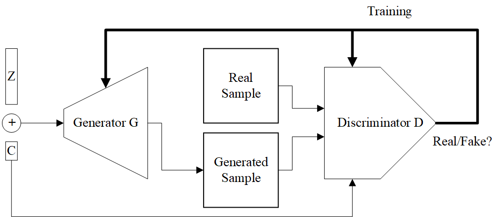
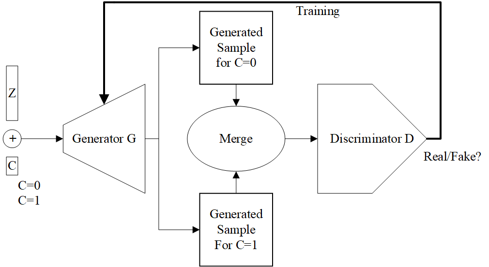
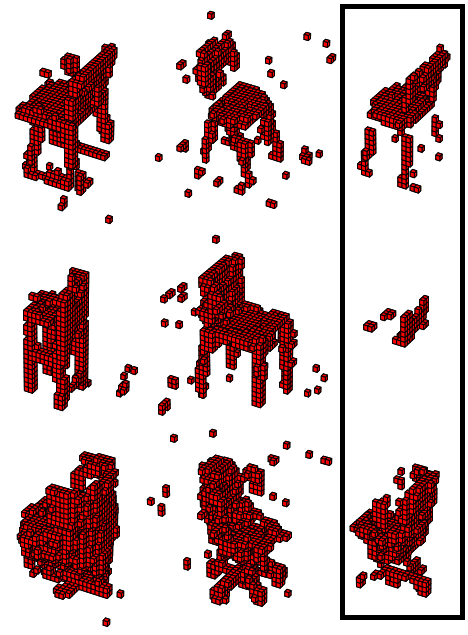
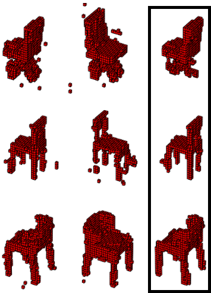
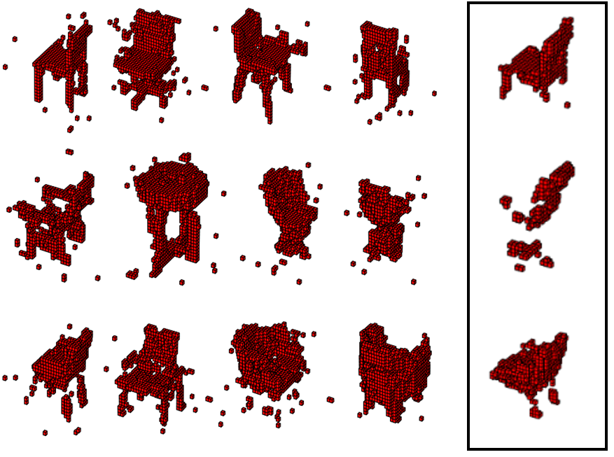
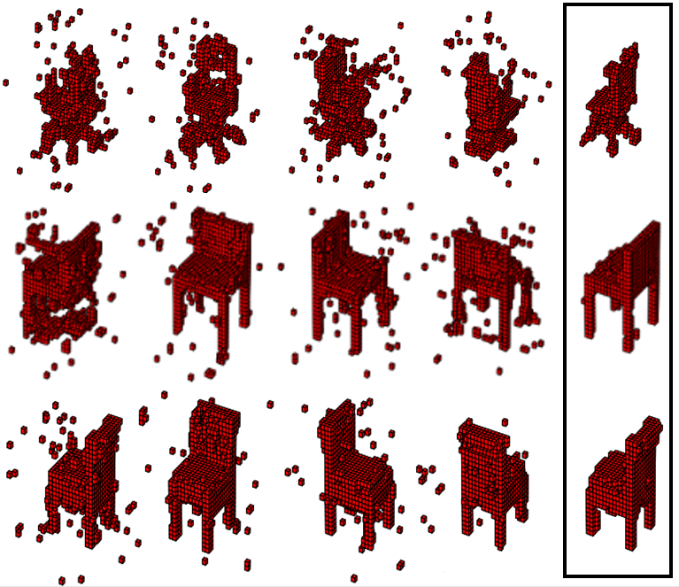

# Paired 3D Model Generation with Conditional Generative Adversarial Networks
Code for "[Paired 3D Model Generation with Conditional Generative Adversarial Networks](https://arxiv.org/abs/1808.03082)" published in ECCV 2018 - 3D Reconstruction in the Wild Workshop

[arXiv link](https://arxiv.org/abs/1808.03082)
> Generative Adversarial Networks (GANs) are shown to be successful at generating new and realistic samples including 3D object models. Conditional GAN, a variant of GANs, allows generating samples in given conditions. However, objects generated for each condition are different and it does not allow generation of the same object in different conditions. In this paper, we first adapt conditional GAN, which is originally designed for 2D image generation, to the problem of generating 3D models in different rotations. We then propose a new approach to guide the network to generate the same 3D sample in different and controllable rotation angles (sample pairs). Unlike previous studies, the proposed method does not require modification of the standard conditional GAN architecture and it can be integrated into the training step of any conditional GAN. Experimental results and visual comparison of 3D models show that the proposed method is successful at generating model pairs in different conditions.
### Implementation
This is an up to date re-implementation of the paper with PyTorch 1.5 (the original code is written with Tensorflow 1). [3D ShapeNets dataset](http://3dshapenets.cs.princeton.edu/) is used for all experiments. Some parts are modified for better results, but the approach and the workflow are the same. Training takes around a few hours on an RTX 2070. You can decrease the batch size to reduce the training time or memory consumption. In that case, you may need to adjust the learning rates or the number of epochs.

 
| Original Conditional GAN | Proposed Method |
|:---:|:---:|
|  |  |
| **Results for condition 0, 1 and intersection** | **Results for condition 0, 1 and intersection** |
|  |  |
| **Results for condition 0, 1, 2, 3 and intersection** | **Results for condition 0, 1, 2, 3 and intersection** |
|  |  |
